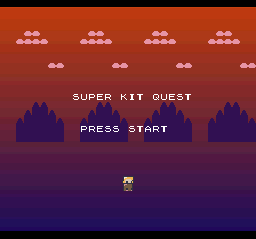
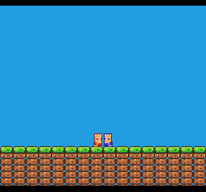
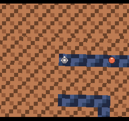
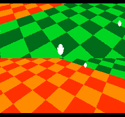
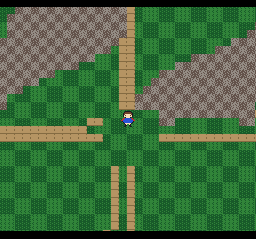
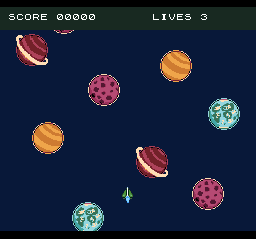
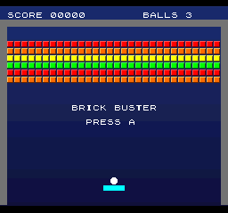
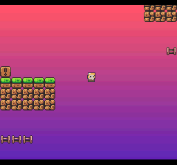

# SuperForge — an agent-first SNES homebrew kit

Write Super Nintendo games in **65816 assembly** with a macro library that
bakes the hardware landmines in, build them with **ca65/ld65**, and verify
every change on the cycle-accurate **Mesen2** emulator — headless, scriptable,
CI-ready. The kit is designed so an AI coding agent (or a human) can go from
*"make me a platformer"* to a **verified, bootable `.sfc`** on proven rails
instead of hallucinated registers.

- **The macro library is the front door** (`lib/macros/`): `sf_coldstart`,
  `spr`, `btn`, `sf_physics_step`, `sf_mode7_cam`, `sf_music`, … plus the
  **streaming front doors** `sf_stream` (Mode-1 normal-BG level streaming) and
  `sf_mode7_stream` (Mode 7 2-axis tilemap streaming), and `sf_physics_step_world`
  (16-bit world-Y jump physics for taller-than-screen levels). Each macro
  expands to the correct engine-call and hardware sequence — width tracking,
  VBlank discipline, OAM X9 bits, DMA re-arm are handled by construction.
- **Templates are the rails** (`templates/`): small, complete, emulator-verified
  games — platformer (flagship), shmup, brawler, Mode 7 racer, block-breaker, and
  the single-mechanic rails they grew from. **Two proven streaming rails** ship a
  world larger than the hardware window that pans seamlessly on both axes:
  `mode7_explore/` (Mode 7 overhead, 512×512-tile world) and `platformer_stream/`
  (Mode 1 side-view, 128×128-tile / 4-screen-per-axis level). Start from the nearest
  one; don't start from zero.
- **Everything is verified** (`tests/`): every template and macro group has a
  pytest that boots the ROM under MesenRunner and asserts on **real hardware
  output** — OAM/VRAM/CGRAM bytes, screenshots, recorded audio — never proxy
  variables.

## Quickstart

Linux (or WSL). Requires `git`, `python3`, and `sudo` for apt packages.

```bash
git clone https://github.com/jreinach-alt/SuperForge && cd SuperForge
bash tools/setup.sh     # cc65 + Python deps + Mesen2 core + end-to-end smoke ROM
make check              # width gate + build every ROM + run the full test suite
```

`tools/setup.sh` is the end-to-end gate: it finishes by assembling a smoke ROM,
running it on the emulator, and reading back its debug magic. If it exits 0,
the whole pipeline works. (First run builds the Mesen2 core from source,
~10 minutes; warm runs finish in seconds.)

**Read [`EXPECTATIONS.md`](EXPECTATIONS.md) before your first bug** — the
churn that's normal on this platform and the 10-minute path through it.

Build and run one game:

```bash
make platformer         # → build/platformer.sfc (any templates/<name> works)
python3 - <<'EOF'
from infrastructure.test_harness.mesen_runner import MesenRunner
r = MesenRunner()
r.load_rom("build/platformer.sfc", run_seconds=2.0)
r.take_screenshot("/tmp/platformer.png")
r.stop()
EOF
```

The `.sfc` files also run in any SNES emulator (Mesen2, bsnes, snes9x) and on
real hardware via a flashcart.

## What the templates look like

Every clip below is **recorded gameplay** — scripted controller input driving
the committed template ROM headlessly on Mesen2, frames captured from the
rendered output (`docs/screenshots/` has stills for every rail):

| | |
|---|---|
|  `platformer` — the flagship: run, jump, coins, enemies |  `split_v_fight` — one camera splits in two and merges back, seamlessly |
|  `m7_dungeon` — tank-control Mode 7: a plan-view (seen-from-above) knight holds screen-centre while slimes stay glued to the spinning floor |  `split_h_2p_demo` — a swarm of AI followers projected onto two independently rotating per-scanline cameras (the measured sprite-stress rail) |
|  `mode7_explore` — Elnora walks a streaming Mode 7 overworld far bigger than VRAM; step onto a house and a mosaic wipe carries her into a Mode 1 town interior, then back out to the overworld at the same spot |  `shmup` — pools, autoscroll, converted CC0 spaceships over a night sky  |
|  `breaker` — bat a ball through a rainbow brick wall; where it strikes the paddle picks its outgoing angle, so the paddle english is a physics receipt a closed-loop bot rallies on |  `platformer_stream` — a side-view level four screens wide *and* tall; fall in, run, and climb as it streams seamlessly on both axes with no pop-in |

## Working with an AI agent

Open this repo in Claude Code (or any agent that reads `AGENTS.md`) and
describe the game you want. The agent operating manual (`AGENTS.md`) routes
every request to the nearest proven template + scenario, adapts it with the
macro library, and verifies the result on the emulator before calling it done.
`scenarios/` is the catalog of what the kit can build and answer — per genre
rail: what it demonstrates, its done-conditions, and the adaptation paths.

## The map

| Where | What |
|---|---|
| `JAM.md` | building a **SNES DEV Game Jam** entry with the kit — rule-by-rule compliance (LoROM/512KB/no-SRAM header profile, PAL testing knob, attribution) |
| `EXPECTATIONS.md` | what using the kit is actually like — the normal churn classes (width flags, write-twice latches), declared gaps, emulator-vs-hardware honesty |
| `lib/macros/` | the API — the single asm front door (start at `lib/macros/README.md`) |
| `templates/` | complete starter games, auto-discovered by the Makefile (`make <name>`) |
| `examples/` | minimal teaching examples (hello_world, buttons, move_sprite) + CC0 art packs |
| `docs/lessons/` | the intro-to-SNES course — 11 run-and-probe lessons (L00-L10) teaching the platform's capabilities *and* limits, honestly (start at `docs/lessons/README.md`) |
| `scenarios/` | the genre-rail catalog — what you can build, done-conditions, adaptation paths |
| `docs/troubleshooting.md` | symptom-indexed fixes — go here FIRST when something misbehaves |
| `docs/snes_vs_modern_engines.md` | the idiom guardrail — read this if your instincts are Unity/Godot-shaped |
| `docs/reference/hardware/` | the hardware knowledgebase router (fetches the authoritative reference) |
| `docs/guides/` | deep dives — Mode 7 racing, sprite-on-floor projection, and the two streaming rails: `normal_bg_streaming.md` (Mode 1) + `mode7_overworld_streaming.md` (Mode 7) |
| `engine/` | the 65816 engine the macros drive (sprites, BG, NMI/DMA, Mode 7, text, collision) |
| `tools/png2snes.py` | PNG → SNES CHR/palette converter (validation-first; sprite + bg + anims + metasprites) |
| `infrastructure/test_harness/` | MesenRunner — the headless emulator harness |
| `tests/` | the verification suite (`make check`) |

## Requirements

- **cc65** (ca65 assembler + ld65 linker) — installed by setup.sh
- **Python 3.10+** with Pillow + pytest — installed by setup.sh
- **Mesen2 core** — built from source by setup.sh (needs libsdl2-dev); cached
  after the first build
- ~64-bit Linux. macOS/Windows: the asm builds anywhere cc65 runs, but the
  test harness expects a Linux `MesenCore.so` (WSL works).

## License

- All first-party code — engine (65816 asm), macro library, templates,
  examples, toolchain & harness (Python), tests: **zlib** (shipped ROMs
  carry no obligations). Exception: the dizworld-derived Mode 7
  perspective files are **CC BY 4.0** — games using that path credit
  Brad Smith (one line; see `JAM.md` + `NOTICE`)
- Documentation: **CC0**
- Shipped art/assets: **CC0** (provenance per `examples/itch_cc0/LICENSES.md`)
- Vendored third party: Terrific Audio Driver ca65 API (**zlib**, `lib/tad/`)
  — see `NOTICE`

See `LICENSE` and `NOTICE` for the full text and attribution.
