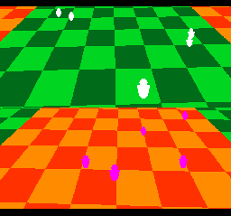
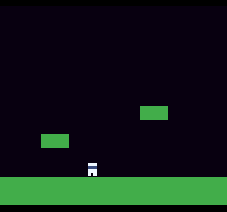
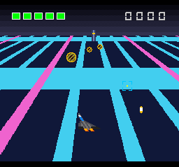
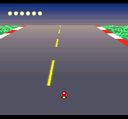
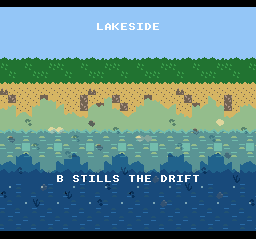
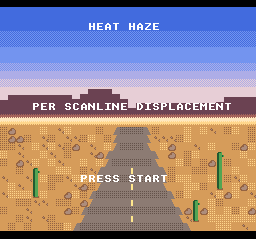
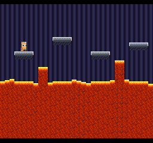

# SuperForge

An SNES game engine built around a **declarative resource allocator**. You
declare what each feature and each scene needs — WRAM, VRAM, CGRAM, direct
page, OAM slots, HDMA channels, VBlank bytes, ROM banks, PPU registers, SPC
RAM, SRAM, DMA slots — and the build *proves* the whole composition is
collision-free before it emits a byte. An infeasible composition stops the
build. A raw address literal stops the build.

Games are hand-written WDC 65816 assembly (ca65/ld65 → `.sfc`) running on real
hardware at a hard 60 fps, with ~28–37k CPU cycles per frame to spend.


*`mode7_flight` ("SKY RUNNER") — the d-pad turns, B throttles, L/R climb and
dive, and altitude drives the perspective scale.*

`game/` holds **39 complete games** built this way. Each one composes declared
features, builds to a 524,288-byte ROM, and ships tests that boot that ROM on a
cycle-accurate emulator and read the rendered output back.

## The idea

SNES homebrew claims its scarce resources by convention. A tilemap sits at VRAM
word `$6000` because a comment says so. A subsystem takes direct-page bytes
`$A0`–`$AF` because nothing else looked like it was using them. HDMA channel 5
belongs to the gradient effect until the day two effects both want it. The
claims live in comments, header files and the author's memory, and nothing
checks them — so each feature works, and the *combination* is where they
collide, silently: a corrupted tilemap, a sprite that vanishes at one camera
position, a subsystem that works fine until another one is switched on.

SuperForge's answer: **you do not allocate resources, you declare them, and the
build proves the declaration.**

- Features declare what they need in `feature.toml`; games in `game.toml` /
  `state.toml`; the machine's real limits live in `allocator/substrate.toml`.
  There are twelve claim classes (`vram`, `wram`, `dp`, `cgram`, `oam`, `hdma`,
  `rom`, `dma`, `dma_init`, `reg`, `spc`, `sram`) — see `allocator/schemas.py`.
- `allocator/allocate.py` packs the claims and **emits symbols** into
  `build/*.inc` + `build/symbol_map.json`. Nothing is hand-placed.
- **An infeasible composition stops the build.** That is the feature, not an
  obstacle: a design answer arriving at build time instead of as a corruption
  bug three sprints later. `make toy-bad` exists to prove the refusal still
  works, and it exits 0 only when the allocator *refused*, on the collision.
- **A raw address literal stops the build** (`allocator/no_literals.py`). You
  physically cannot hardcode an address, a channel number, or a register
  encoding. Collisions are unexpressible, not merely detected.

The developer's own game state is a first-class consumer of the same allocator,
at global or scene scope, handed back as named symbols — there is no hunting
for a free byte. Scene-scoped bytes are reused between scenes, which is why a
title screen does not have to reserve Mode 7's VRAM.

None of this is hypothetical damage. The three subsystems that are hardest to
land on this machine — split-mode rendering, large-world Mode 7 streaming, and
variable-width fonts — are precisely the ones that fail as *compositions*: each
works alone, and each collides with something else over a resource neither side
ever wrote down. Making the composition provable is the whole design, and all
three of them are in `game/` and `engine/features/` because of it.

## One cart, both regions

The 16-bit era's standard PAL conversion shipped the NTSC game unchanged and
let a 50 Hz console play it at 83.2% speed. European players spent a
generation complaining about it, and it is still the normal homebrew answer.

This kit's answer is a declared one. A game states its per-frame rates against
a **tick**; `engine/features/region` reads the console's own region line once
at boot and `engine/features/tick_scale` scales that tick by the measured
frame ratio, carrying the fraction between frames. Everything downstream keeps
saying "move one step" — what a step *is* becomes a property of the timebase.
The same ROM then covers the same distance per **second** on both machines.

It is opt-in, per game. **32 of the 39 games compose it** — every playable one,
plus both screen-effect rails — and every one of them is measured, at a
real-time parity band of **0.994–1.027** against the **0.832** an uncompensated
game reads. The other seven decline in their own
`game.toml`: all are determinism trials whose frame-indexed sweeps are the
thing under test. NTSC does not move — the picture is pixel-identical against
every pre-change image, per game.
[`docs/98`](docs/98_region_fleet_landing.md) has the band, the exemptions and
the two one-time deferrals with the addenda that converted them.

## The showcase

Eleven of the library's games, and what each one proves. Every clip is recorded
from the committed ROM at full gameplay speed, one GIF second to one gameplay
second, and cut so it rejoins itself — the loop points and their measured seams
are in [`reports/gallery_loop_seams.md`](reports/gallery_loop_seams.md).

### `mode7_flight` — "SKY RUNNER"

The clip at the top of this page is this game.

Free flight over a Mode 7 perspective floor with **player-driven altitude**.
The exact pose table for 256 headings × 81 altitudes is 12.7 MB against a
512 KB ROM ceiling, so the pose is baked as the two factors it decomposes into
(~28 KB, exact on both axes) and joined per frame by one hardware multiply per
coefficient per scanline. 60 fps with **zero dropped ticks over 240 frames of
worst-case input**, and the whole join measured at well under half the frame —
both asserted live off the shipping binary in `tests/test_mode7_flight.py`.

| | | |
|---|---|---|
|  |  |  |
| the spawn | climbing to the ceiling | the free-running day/night clock |

The clock is the one axis the clip cannot hold: a full cycle is 2,048 frames,
34 s at 1:1, so the stills carry the poles the loop has no room for.

### `m7_oshoot`


A run-and-gun on a spinning Mode 7 arena. The pivot re-pins to the player every
frame; everything but the hero is projected onto the turning floor through the
render matrix's **transpose**, and the gameplay runs entirely in world space and
never reads the matrix.

### `split_v_fight`


A two-player fight on a shared stage, where the camera splits because the
fighters do. Two cameras onto **one** VRAM copy of the stage, clipped to
opposite screen halves by PPU window 1 and diverging with the fighters'
distance. Watch the divider: it grows out of nothing as the pair back off to
the arena walls, and the ridge and treeline on one side of it stop lining up
with the ones on the other — the two halves are looking at different stretches
of the same stage. Walking back in closes it to an invisible seam, where the
halves are pixel-identical. Then they trade, in close, where the separation is
small enough that the view stays merged: two pads, life bars, a 3-2-1-FIGHT
round start, a swing with active frames, and a jump that clears one.

### `split_h_2p_demo`



Two **independent** Mode 7 cameras in a single frame, and neither one solves a
perspective matrix: each band streams a ROM-resident per-scanline pose table
straight through indirect HDMA, so the whole per-frame cost is a handful of
VBlank stores. The two floors turn opposite ways from their own world positions
while 24 entities — two tracking the cameras, 22 steering their own waypoint
loops — are projected into **both** bands every frame. One cart runs it at speed
on either console: a second baked movement table at the PAL magnitude, picked at
scene enter, puts PAL at a measured **0.9997–1.0009** of NTSC's real-time rate
with no repeated state step.

### `mode7_explore`


A streamed Mode 7 overworld far larger than VRAM, a Mode 7 ⇄ Mode 1 swap into a
town interior, and a mosaic transition between them — three subsystems that
have to share the frame, VRAM and the DMA budget without a single hand-placed
address between them.

### `meteor_event`



A mid-level Mode 1 ⇄ Mode 7 cutscene. The walking level freezes, its BG
platforms are **captured into sprites** so they survive the mode swap, and the
meteor grows on the affine plane behind them. The handover is a declared
40-slot OAM claim, not an unbounded trick.

### `boss_saucer`


The saucer *is* the Mode 7 background — it grows in out of the star field,
then dives at you, the matrix zooming it from a 71-pixel disc to a 141-pixel
one and back, four times a fight. At the top of each dive it aims a sight line
out of the glowing emitter at its own belly, straight down at the lane you are
standing in, and a beat later fires a lance along it: strafe out of the line
during the telegraph, and get back under the saucer, because your shots only
land from underneath. It reuses the scale-track feature the `boss` game
declares, with **zero edits to that feature**: composition, which is the whole
point.

### `railshooter`



Depth from a decoupled pinhole (1/z) projection, explicitly *not* the Mode 7
matrix inverse: pre-drawn size tiers and a depth-sorted OAM emit that never
sorts.

### `racer`



A kart on a Mode 7 perspective floor, flat out around a sixteen-corner circuit
sixteen times the size of the VRAM window it streams through. Course and
handling are one design: a 153 px full-speed turning circle against 232 px of
drivable road, so every corner is takeable at the cap and none of them is free.
The map is the collision ground truth — off the road the kart drags down to a
crawl — and a day-night wash walks the sky and the floor. It is also the
**channel-pressure** rail: seven of the eight HDMA channels live in one frame,
two of those numbers shared with claims that run in VBlank.

### `lakeside`



A lakeshore where the water is really water. The bed — silt, pebbles,
sandbars, a shelf dropping into the deep — is drawn once, and the surface is a
second layer the hardware blends over it as the screen is painted, so you are
looking *through* the water at the bed rather than at a picture of what that
would look like. Watch the shoreline: it drifts as a pixel edge rather than a
row of tiles, and a wave running up the sand shades it wet, then gives it back
dry as the backwash draws down. Nothing repaints a wet palette — the shading
is just what the blend already does. The text stays readable because it is
left out of the math.


### `heathaze`



A desert road running to a mesa ridge, with the air shimmering over it. Every
scanline below the horizon is drawn from a slightly different row of the
world, so the ground squashes and stretches and the road, its dashes and the
cacti all boil. The vertical axis is the whole trick: sliding rows sideways
only shears the picture and never makes it swim. A gentler sideways wobble
runs on top at its own pace, so the distortion slides across ground that is
already moving. Watch the sky and the ridge above the band — they do not move
at all, which is what makes it read as heat rather than as a broken picture.


### `smelter`



A foundry floor, and every eight-pixel column of it scrolls on its own. Four
steel plates hang over a cavern of molten metal and each rises and falls to its
own beat, so no two are ever in step; between them the melt lifts straight out
of its own surface in arches — a broad one where the gap is wide, a single
lifted column where it is narrow, and one lone column of metal standing at the
right-hand edge. Under the plates the melt is calm. Nothing here is a
scanline effect and nothing here is animation frames: the whole picture is bent
by a **third background layer the hardware reads as data instead of drawing**,
one number per column, refreshed once a frame. Watch two neighbouring columns
of the melt — one can be forty pixels up while the other has not moved.

---

The other 29 games are in `game/` — among them `microzero`, the smallest
complete game and the gate the whole architecture was bet on: title → a
single-track time-trial race → results → title, one 524,288-byte ROM, globals
surviving the scene edges and scene bytes reused across them. The `gates:` block
of the [`Makefile`](Makefile) is the working inventory — every one is built and
checked there. `make rail-registered` fails the build if a game is missing from
any of the places it has to be named.

## Quick start

```bash
bash tools/setup.sh     # ca65/ld65, libSDL2, MesenCore.so, Pillow, pytest
make toy                # the allocator end to end + the toy ROM -> 32,768 B
make microzero          # the smallest complete game             -> 524,288 B
make mode7_flight       # the showcase game                      -> 524,288 B
make toy-bad            # the collision gate: passes iff the ALLOCATOR refused
make width-check        # width-tracking lint, strict, zero findings
python3 -m pytest tests/ -q             # the suite, on the emulator
make bare-check         # the landing gate: the whole block, in a clone of HEAD
```

Everything runs from the repo root and nothing outside it is required.
`make bare-check` is the landing gate — it clones HEAD into a scratch directory
and runs the whole gate block there, so the build sees only committed content
and none of your working tree's stale artifacts. What that does and does not
buy: [`docs/44`](docs/44_bare_check_migration.md).

## Try it

```bash
git clone https://github.com/jreinach-alt/SuperForge.git && cd SuperForge
```

Open the clone in your coding agent and walk through these prompts in order;
prompt 2 is where your own idea enters.

1. > Set up this repo (`bash tools/setup.sh`), then build the `mode7_flight`
   > game and capture screenshots of it running (`tools/shot_mode7_flight.py`).
   > Show me the pictures and tell me what I'm looking at.

2. > My game idea: *\<a few sentences — genre, camera, the core mechanic, one
   > signature moment\>*. Read this repo's docs and its game library, then
   > tell me honestly: (a) which parts of my idea this engine already proves —
   > name the game in `game/` that demonstrates each part; (b) which parts are
   > near — existing features composed in a new way; (c) which parts would be
   > new engine work, and what resources they would have to claim; (d)
   > anything that fights this hardware itself, and the design adjustment that
   > would fit it. Don't sell me — if a piece doesn't fit, say so and show me
   > the nearest thing that works.

3. > Take the library game nearest my idea and make a small visible change: a
   > palette, the backdrop gradient, a piece of HUD text. Rebuild it and show
   > me before/after screenshots. Tell me which files you touched and what the
   > allocator had to say about it.

4. > Scaffold a new game under `game/` for my idea: a `game.toml` composing
   > the features it needs, a first scene that boots and renders its world
   > (static is fine), my game's own state declared through the allocator, and
   > a test that boots the ROM and reads the rendered output back. Build it,
   > run the test, screenshot it. If a feature my idea needs doesn't exist
   > yet, stub the scene so the composition still allocates, and name the gap.

5. > Implement the first playable slice of my core mechanic: the one
   > interaction that makes it your game. Wire input, motion, and one
   > collision-or-feedback response. Hold 60 fps — prove it the way the
   > library games do, by measuring, not estimating — and show me screenshots
   > of the mechanic working.

Each prompt has a matching lesson in [`docs/lessons/`](docs/lessons/), and the
two companion docs carry the map:
[`docs/capability_envelope.md`](docs/capability_envelope.md) for what the
library already proves,
[`docs/hardware_for_your_idea.md`](docs/hardware_for_your_idea.md) for what
the machine itself will and will not do.

## How it is tested

These are rules the tree is held to by a gate, not intentions.

- **Cycle-accurate, in lockstep.** Tests drive Mesen2 headless through a
  `Machine` API that is loaded parked and advances only by synchronous calls —
  no free-run, no wall-clock waits, no timeouts. Those properties are absent
  from the surface rather than policed by lint
  ([`docs/53`](docs/53_deterministic_harness_settlement.md)).
- **Tests read the rendered output.** VRAM, OAM, CGRAM or screenshot pixels —
  never a proxy variable that "should be" a function of the picture. A test
  that passes while the feature is silently broken is worse than no test.
- **No test may be calibrated against the host clock.** Waits are in emulated
  frames; when the picture is the assertion, the capture lands on an absolute
  frame. `make time-check` enforces it, the baseline is empty, and the single
  override form requires a written reason
  ([`docs/45`](docs/45_time_coupling_gate.md)).
- **The gates are falsified, not trusted.** `make falsify` plants a defect per
  guarded behaviour and requires the **artifact md5 to move** before it will
  even run the tests — a plant that never reached the binary used to read as a
  pass — then requires the named tests to go red and the tree to restore
  exactly ([`docs/46`](docs/46_falsification_harness.md)).
- **The budgets are pins, and pins are tripwires.** VBlank 5,952 B/frame and a
  worst-case 60 fps frame of 305,348 master clocks are *measured* numbers in
  `allocator/substrate.toml`; `make measure` re-measures and fails on drift.
- **Landing evidence is a citable artifact, not a badge.** Most recent:
  `make bare-check` **GREEN** — every gate in `make gates`, 63 ROM images
  measured against their own headers (53 of them *demanded* by a set derived
  from what the gate block builds, so an image that stops being built goes red
  by name), the full ~2,000-test suite green, both game-ROM md5 pins unmoved,
  all from a fresh clone of HEAD. Recorded, with its SHA, in
  `build/bare_check.json`.

## The library

An allocator that refuses bad compositions is only worth something if good
compositions are plentiful, varied and hard. So the bar this engine is held to
is a library of finished games rather than a feature checklist. All 39 declare
their features in a `game.toml`, take every address from the allocator, build to
a byte-exact ROM, and are verified by booting that ROM and reading what the PPU
actually produced.

They crowd the hardware's hard corners on purpose — perspective and affine
Mode 7, world streaming larger than VRAM, window-clipped dual cameras, scanline
IRQs, mid-level video-mode swaps, per-scanline HDMA colour, sprite pools, SRAM
saves, audio — and, more to the point, they make those things share one frame,
one VRAM and one DMA budget at once. That is the case where convention fails
and a proof does not.

## The repo

```
allocator/   the declarative allocator + the collision and no-literals gates
engine/      the 65816 engine — features/ (166 dirs), toy/ (the smallest thing
             the allocator can prove) and toy_bad/ (its infeasible twin)
game/        39 games — a game.toml, its scenes, and the game's own state.toml
tests/       pytest, driving ROMs on the cycle-accurate emulator
tools/       setup, the linters, asset generators, the render/capture scripts
vendor/      vendored and self-contained: the emulator harness, fonts, ROM
             headers, the CPU probes, and the reference sources they measure
docs/        the hardware substrate, the feature register, and the gate and
             harness documents
```

Two files carry the working rules, in this order:

| file | job |
|---|---|
| [`CLAUDE.md`](CLAUDE.md) | the **rules** — the seven non-negotiables |
| [`AGENTS.md`](AGENTS.md) | the **operating manual** — what to run, how the allocator changes the way you write code, the anti-patterns already paid for |

Then [`docs/01`](docs/01_substrate_reference.md) — the hardware budget and the
constraints the allocator solves against. What each feature supplies and claims
is [`docs/09`](docs/09_feature_register.md), which `make register` gates against
the tree; [`docs/08`](docs/08_feature_register_spec.md) is the spec that
register is written to. The design story — what this engine is, why it is
shaped this way, and what holds it true — is [`design.md`](design.md).

## Licence

SuperForge's first-party code is under the zlib licence — see
[`LICENSE`](LICENSE). Vendored and generated components carry their own terms,
recorded per component in [`NOTICE`](NOTICE).
