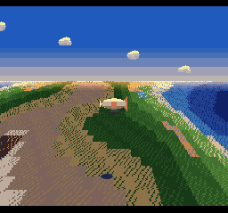
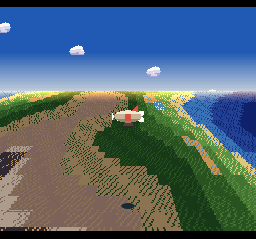
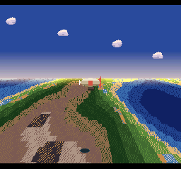
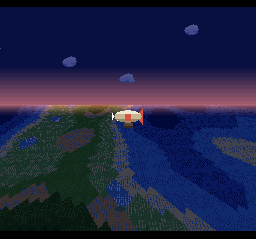
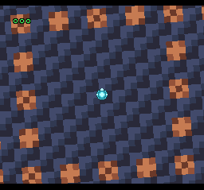
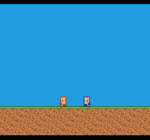
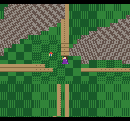

# SuperForge

An SNES game engine built around a **declarative resource allocator**. You
declare what each feature and each scene needs — WRAM, VRAM, CGRAM, direct
page, OAM slots, HDMA channels, VBlank bytes, ROM banks, PPU registers, SPC
RAM, SRAM, DMA slots — and the build *proves* the whole composition is
collision-free before it emits a byte. An infeasible composition stops the
build. A raw address literal stops the build.

Games are hand-written WDC 65816 assembly (ca65/ld65 → `.sfc`) running on real
hardware at a hard 60 fps, with ~28–37k CPU cycles per frame to spend.



*`mode7_flight` ("SKY RUNNER") — the d-pad turns, B throttles, L/R climb and
dive, and altitude drives the perspective scale.*

`game/` holds **37 complete games** built this way. Each one composes declared
features, builds to a 524,288-byte ROM, and ships tests that boot that ROM on a
cycle-accurate emulator and read the rendered output back.

## The idea

SNES homebrew claims its scarce resources by convention. A tilemap sits at VRAM
word `$6000` because a comment says so. A subsystem takes direct-page bytes
`$A0`–`$AF` because nothing else looked like it was using them. HDMA channel 5
belongs to the gradient effect until the day two effects both want it. The
claims live in comments, header files and the author's memory, and nothing
checks them — so each feature works, and the *combination* is where they
collide, silently: a corrupted tilemap, a sprite that vanishes at one camera
position, a subsystem that works fine until another one is switched on.

SuperForge's answer: **you do not allocate resources, you declare them, and the
build proves the declaration.**

- Features declare what they need in `feature.toml`; games in `game.toml` /
  `state.toml`; the machine's real limits live in `allocator/substrate.toml`.
  There are twelve claim classes (`vram`, `wram`, `dp`, `cgram`, `oam`, `hdma`,
  `rom`, `dma`, `dma_init`, `reg`, `spc`, `sram`) — see `allocator/schemas.py`.
- `allocator/allocate.py` packs the claims and **emits symbols** into
  `build/*.inc` + `build/symbol_map.json`. Nothing is hand-placed.
- **An infeasible composition stops the build.** That is the feature, not an
  obstacle: a design answer arriving at build time instead of as a corruption
  bug three sprints later. `make toy-bad` exists to prove the refusal still
  works, and it exits 0 only when the allocator *refused*, on the collision.
- **A raw address literal stops the build** (`allocator/no_literals.py`). You
  physically cannot hardcode an address, a channel number, or a register
  encoding. Collisions are unexpressible, not merely detected.

The developer's own game state is a first-class consumer of the same allocator,
at global or scene scope, handed back as named symbols — there is no hunting
for a free byte. Scene-scoped bytes are reused between scenes, which is why a
title screen does not have to reserve Mode 7's VRAM.

None of this is hypothetical damage. The three subsystems that are hardest to
land on this machine — split-mode rendering, large-world Mode 7 streaming, and
variable-width fonts — are precisely the ones that fail as *compositions*: each
works alone, and each collides with something else over a resource neither side
ever wrote down. Making the composition provable is the whole design, and all
three of them are in `game/` and `engine/features/` because of it.

## The showcase

| | | |
|---|---|---|
|  |  |  |
| the spawn | climbing to the ceiling | the free-running day/night clock |

| game | what it is, and what it proves |
|---|---|
| **`mode7_flight`** — "SKY RUNNER" | Free flight over a Mode 7 perspective floor with **player-driven altitude**. The exact pose table for 256 headings × 81 altitudes is 12.7 MB against a 512 KB ROM ceiling, so the pose is baked as the two factors it decomposes into (~28 KB, exact on both axes) and joined per frame by one hardware multiply per coefficient per scanline. 60 fps with **zero dropped ticks over 240 frames of worst-case input**, and the whole join measured at well under half the frame — both asserted live off the shipping binary in `tests/test_mode7_flight.py`. |
| **`m7_oshoot`** | A run-and-gun on a spinning Mode 7 arena. The pivot re-pins to the player every frame; everything but the hero is projected onto the turning floor through the render matrix's **transpose**, and the gameplay runs entirely in world space and never reads the matrix. |
| **`split_v_fight`** | Two cameras onto one stage, clipped to opposite screen halves by PPU window 1 and diverging with the fighters' distance. One VRAM copy, two cameras: at zero separation the halves are pixel-identical and the ever-present seam is invisible. |
| **`mode7_explore`** | A streamed Mode 7 overworld far larger than VRAM, a Mode 7 ⇄ Mode 1 swap into a town interior, and a mosaic transition between them — three subsystems that have to share the frame, VRAM and the DMA budget without a single hand-placed address between them. |
| **`meteor_event`** | A mid-level Mode 1 ⇄ Mode 7 cutscene. The walking level freezes, its BG platforms are **captured into sprites** so they survive the mode swap, and the meteor grows on the affine plane behind them. The handover is a declared 40-slot OAM claim, not an unbounded trick. |
| **`boss_saucer`** | The saucer *is* the Mode 7 background — it lunges from a far speck to a screen-filling disc, then fires a beam down the column you were standing in. It reuses the scale-track feature the `boss` game declares, with **zero edits to that feature**: composition, which is the whole point. |
| **`railshooter`** | Depth from a decoupled pinhole (1/z) projection, explicitly *not* the Mode 7 matrix inverse: pre-drawn size tiers and a depth-sorted OAM emit that never sorts. |
| **`microzero`** | The smallest complete game, and the gate the whole architecture was bet on: title → a single-track time-trial race → results → title, one 524,288-byte ROM, globals surviving the scene edges and scene bytes reused across them. |







The other 29 games are in `game/`, and the `gates:` block of the
[`Makefile`](Makefile) is the working inventory — every one is built and
checked there. `make rail-registered` fails the build if a game is missing from
any of the places it has to be named.

## Quick start

```bash
bash tools/setup.sh     # ca65/ld65, libSDL2, MesenCore.so, Pillow, pytest
make toy                # the allocator end to end + the toy ROM -> 32,768 B
make microzero          # the smallest complete game             -> 524,288 B
make mode7_flight       # the showcase game                      -> 524,288 B
make toy-bad            # the collision gate: passes iff the ALLOCATOR refused
make width-check        # width-tracking lint, strict, zero findings
python3 -m pytest tests/ -q             # the suite, on the emulator
make bare-check         # the landing gate: the whole block, in a clone of HEAD
```

Everything runs from the repo root and nothing outside it is required.
`make bare-check` is the landing gate — it clones HEAD into a scratch directory
and runs the whole gate block there, so the build sees only committed content
and none of your working tree's stale artifacts. What that does and does not
buy: [`docs/44`](docs/44_bare_check_migration.md).

## How it is tested

These are rules the tree is held to by a gate, not intentions.

- **Cycle-accurate, in lockstep.** Tests drive Mesen2 headless through a
  `Machine` API that is loaded parked and advances only by synchronous calls —
  no free-run, no wall-clock waits, no timeouts. Those properties are absent
  from the surface rather than policed by lint
  ([`docs/53`](docs/53_deterministic_harness_settlement.md)).
- **Tests read the rendered output.** VRAM, OAM, CGRAM or screenshot pixels —
  never a proxy variable that "should be" a function of the picture. A test
  that passes while the feature is silently broken is worse than no test.
- **No test may be calibrated against the host clock.** Waits are in emulated
  frames; when the picture is the assertion, the capture lands on an absolute
  frame. `make time-check` enforces it, the baseline is empty, and the single
  override form requires a written reason
  ([`docs/45`](docs/45_time_coupling_gate.md)).
- **The gates are falsified, not trusted.** `make falsify` plants a defect per
  guarded behaviour and requires the **artifact md5 to move** before it will
  even run the tests — a plant that never reached the binary used to read as a
  pass — then requires the named tests to go red and the tree to restore
  exactly ([`docs/46`](docs/46_falsification_harness.md)).
- **The budgets are pins, and pins are tripwires.** VBlank 5,952 B/frame and a
  worst-case 60 fps frame of 305,348 master clocks are *measured* numbers in
  `allocator/substrate.toml`; `make measure` re-measures and fails on drift.
- **Landing evidence is a citable artifact, not a badge.** Most recent:
  `make bare-check` **GREEN** — every gate in `make gates`, 38 ROM sizes exact,
  the full ~1,900-test suite green, both game-ROM md5 pins unmoved, all from
  a fresh clone of HEAD. Recorded, with its SHA, in `build/bare_check.json`.

## The library

An allocator that refuses bad compositions is only worth something if good
compositions are plentiful, varied and hard. So the bar this engine is held to
is a library of finished games rather than a feature checklist. All 37 declare
their features in a `game.toml`, take every address from the allocator, build to
a byte-exact ROM, and are verified by booting that ROM and reading what the PPU
actually produced.

They crowd the hardware's hard corners on purpose — perspective and affine
Mode 7, world streaming larger than VRAM, window-clipped dual cameras, scanline
IRQs, mid-level video-mode swaps, per-scanline HDMA colour, sprite pools, SRAM
saves, audio — and, more to the point, they make those things share one frame,
one VRAM and one DMA budget at once. That is the case where convention fails
and a proof does not.

## The repo

```
allocator/   the declarative allocator + the collision and no-literals gates
engine/      the 65816 engine — features/ (155 dirs), toy/ (the smallest thing
             the allocator can prove) and toy_bad/ (its infeasible twin)
game/        37 games — a game.toml, its scenes, and the game's own state.toml
tests/       pytest, driving ROMs on the cycle-accurate emulator
tools/       setup, the linters, asset generators, the render/capture scripts
vendor/      vendored and self-contained: the emulator harness, fonts, ROM
             headers, the CPU probes, and the reference sources they measure
docs/        the hardware substrate, the feature register, and the gate and
             harness documents
```

Two files carry the working rules, in this order:

| file | job |
|---|---|
| [`CLAUDE.md`](CLAUDE.md) | the **rules** — the seven non-negotiables |
| [`AGENTS.md`](AGENTS.md) | the **operating manual** — what to run, how the allocator changes the way you write code, the anti-patterns already paid for |

Then [`docs/01`](docs/01_substrate_reference.md) — the hardware budget and the
constraints the allocator solves against. What each feature supplies and claims
is [`docs/09`](docs/09_feature_register.md), which `make register` gates against
the tree; [`docs/08`](docs/08_feature_register_spec.md) is the spec that
register is written to.

## Licence

SuperForge's first-party code is under the zlib licence — see
[`LICENSE`](LICENSE). Vendored and generated components carry their own terms,
recorded per component in [`NOTICE`](NOTICE).
